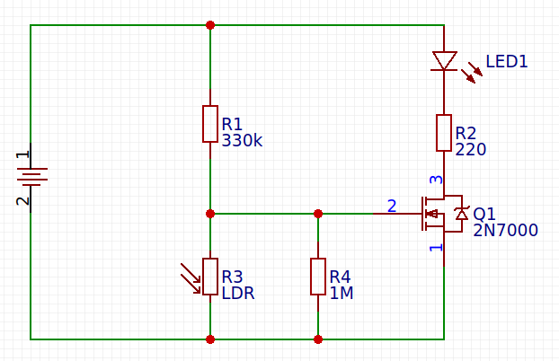

# nightlight-with-fet

## Description
A simple, battery powered LED nightlight which automatically turns on when it's dark.

Power consumption is minimal. Batteries will typically last for several months.

This variant uses a single FET instead of bipolar transistors, which reduces the component
count significantly.

## Schematic

## Specifications
* Recommended supply voltage: 3,5-4,5 V (three AA alkaline or NiMH cells)
* Quiescent current: less than 5 µA
* Operating current: 5-10 mA

## Components
* R1 330 kΩ
* R2 220 Ω
* R3 LDR (general purpose)
* R4 1 MΩ
* Q1 2N7000
* LED 5mm 16000 mcd
* 3 AA cells (alkaline or NiMH)

Resistors are rated 1/4 W. Tolerances are not critical.

## Note
If only two NiMH cells are used (resulting in 2,4 V nominally), R1 should be decreased to
100 kΩ. Otherwise the gate voltage of Q1 might not rise high enough to turn Q1 on. Lowering
R1 will increase the quiescent current slightly to around 30 µA which reduces the run time.
Using three AA cells is recommended, because this also allows driving white LEDs at highe
power with NiMH cells.

## Operation
During daylight, the LDR's resistance is low, which pulls the gate voltage of Q1 low. Q1
will not conduct, and the LED is off.

At night, the resistance of the LDR is high, which allows the gate voltage to rise to the
point that Q1 turns on, and the LED will light.
